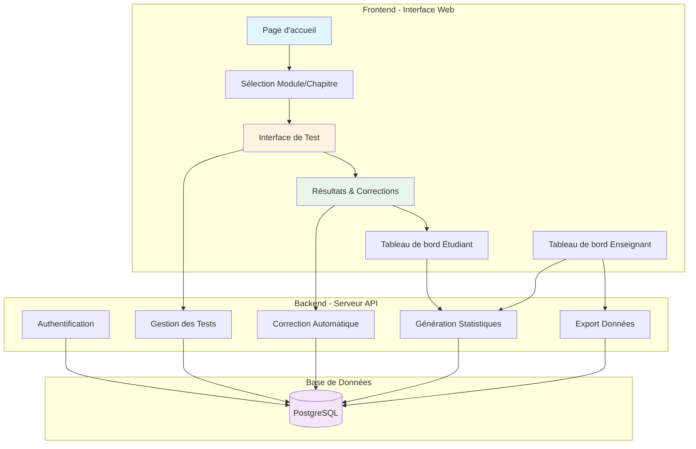

# Architecture Technique - Plateforme d'Évaluation en Physique

> [!NOTE]
> Cette architecture propose une solution **légère, moderne et facile à maintenir** pour une plateforme d'évaluation destinée aux étudiants de première année universitaire.

---

## 🎯 Objectifs Techniques

- **Simplicité** : architecture facile à déployer et maintenir
- **Performance** : chargement rapide, expérience fluide
- **Sécurité** : protection des données étudiants et des résultats
- **Évolutivité** : possibilité d'ajouter de nouveaux modules facilement
- **Accessibilité** : interface responsive (PC, tablette, mobile)

---

## 🏗️ Stack Technologique Recommandée

### Frontend (Interface Utilisateur)
```
HTML5 + CSS3 + JavaScript Vanilla
ou
React.js (si vous souhaitez une solution plus moderne)
```

**Avantages :**
- ✅ Pas de dépendances lourdes
- ✅ Performance optimale
- ✅ Compatibilité universelle
- ✅ Facilité de maintenance

**Bibliothèques complémentaires :**
- **MathJax** ou **KaTeX** : rendu des formules mathématiques
- **Chart.js** : graphiques de progression et statistiques
- **TailwindCSS** (optionnel) : design moderne et responsive

---

### Backend (Logique Serveur)

**Option 1 - Pour débutants :**
```
Node.js + Express.js
```

**Option 2 - Pour Python :**
```
Python + Flask ou FastAPI
```

**Avantages Node.js/Express :**
- ✅ JavaScript côté serveur (même langage que le frontend)
- ✅ Écosystème riche (npm)
- ✅ Performance excellente pour API REST
- ✅ Facile à déployer

**Avantages Python/Flask :**
- ✅ Syntaxe simple et claire
- ✅ Excellent pour traitement de données
- ✅ Bibliothèques scientifiques riches
- ✅ Idéal si vous êtes familier avec Python

---

### Base de Données

**Recommandation :**
```
PostgreSQL (relationnel)
ou
MongoDB (NoSQL)
```

**PostgreSQL - Idéal pour ce projet :**
- ✅ Structure de données claire (étudiants, tests, résultats)
- ✅ Requêtes SQL robustes
- ✅ Intégrité des données garantie
- ✅ Open source et gratuit

**Structure simplifiée :**
- Table `students` : informations étudiants
- Table `tests` : tests disponibles
- Table `questions` : banque de questions
- Table `results` : résultats des tests
- Table `answers` : réponses des étudiants

---

## 📐 Architecture Système



---

## 🗂️ Structure des Fichiers du Projet

```
physique-evaluation-platform/
│
├── frontend/                      # Interface utilisateur
│   ├── public/
│   │   ├── index.html            # Page principale
│   │   ├── styles/
│   │   │   ├── main.css          # Styles globaux
│   │   │   ├── test.css          # Styles interface de test
│   │   │   └── dashboard.css     # Styles tableau de bord
│   │   └── assets/
│   │       ├── images/           # Logos, icônes
│   │       └── fonts/            # Polices personnalisées
│   │
│   ├── src/
│   │   ├── js/
│   │   │   ├── app.js            # Point d'entrée
│   │   │   ├── auth.js           # Authentification
│   │   │   ├── test-engine.js    # Moteur de test
│   │   │   ├── results.js        # Affichage résultats
│   │   │   └── api.js            # Appels API
│   │   └── components/
│   │       ├── header.js         # En-tête
│   │       ├── question.js       # Composant question
│   │       └── timer.js          # Chronomètre
│   │
│   └── package.json              # Dépendances frontend
│
├── backend/                       # Serveur API
│   ├── src/
│   │   ├── routes/
│   │   │   ├── auth.js           # Routes authentification
│   │   │   ├── tests.js          # Routes tests
│   │   │   ├── results.js        # Routes résultats
│   │   │   └── admin.js          # Routes administration
│   │   │
│   │   ├── controllers/
│   │   │   ├── testController.js # Logique des tests
│   │   │   ├── userController.js # Gestion utilisateurs
│   │   │   └── statsController.js# Statistiques
│   │   │
│   │   ├── models/
│   │   │   ├── Student.js        # Modèle étudiant
│   │   │   ├── Test.js           # Modèle test
│   │   │   ├── Question.js       # Modèle question
│   │   │   └── Result.js         # Modèle résultat
│   │   │
│   │   ├── middleware/
│   │   │   ├── auth.js           # Middleware authentification
│   │   │   └── validation.js     # Validation des données
│   │   │
│   │   └── utils/
│   │       ├── scoring.js        # Calcul des scores
│   │       └── generator.js      # Génération de tests
│   │
│   ├── config/
│   │   ├── database.js           # Configuration BDD
│   │   └── server.js             # Configuration serveur
│   │
│   ├── server.js                 # Point d'entrée serveur
│   └── package.json              # Dépendances backend
│
├── database/
│   ├── schema.sql                # Schéma de base de données
│   ├── seed.sql                  # Données de test
│   └── migrations/               # Scripts de migration
│
├── data/                         # Banque de questions
│   ├── optique-geometrique.json
│   ├── electrostatique.json
│   ├── electrocinetique.json
│   └── magnetisme.json
│
└── docs/                         # Documentation
    ├── api-documentation.md      # Documentation API
    ├── user-guide.md             # Guide utilisateur
    └── admin-guide.md            # Guide administrateur
```

---

## 🗄️ Schéma de Base de Données

### Table `students`
```sql
CREATE TABLE students (
    id SERIAL PRIMARY KEY,
    email VARCHAR(255) UNIQUE NOT NULL,
    password_hash VARCHAR(255) NOT NULL,
    first_name VARCHAR(100) NOT NULL,
    last_name VARCHAR(100) NOT NULL,
    student_number VARCHAR(50) UNIQUE,
    created_at TIMESTAMP DEFAULT CURRENT_TIMESTAMP,
    last_login TIMESTAMP
);
```

### Table `tests`
```sql
CREATE TABLE tests (
    id SERIAL PRIMARY KEY,
    title VARCHAR(255) NOT NULL,
    module VARCHAR(100) NOT NULL,  -- 'optique', 'electrostatique', etc.
    chapitre VARCHAR(100),
    duration_minutes INTEGER,      -- Durée du test en minutes
    total_points INTEGER,
    difficulty_level VARCHAR(20),  -- 'basique', 'intermediaire', 'avance', 'mixte'
    active BOOLEAN DEFAULT true,
    created_at TIMESTAMP DEFAULT CURRENT_TIMESTAMP
);
```

### Table `questions`
```sql
CREATE TABLE questions (
    id SERIAL PRIMARY KEY,
    test_id INTEGER REFERENCES tests(id),
    module VARCHAR(100) NOT NULL,
    chapitre VARCHAR(100),
    question_text TEXT NOT NULL,
    option_a TEXT NOT NULL,
    option_b TEXT NOT NULL,
    option_c TEXT NOT NULL,
    option_d TEXT NOT NULL,
    correct_answer CHAR(1) NOT NULL,  -- 'A', 'B', 'C', ou 'D'
    explanation TEXT,
    difficulty INTEGER,               -- 1, 2, ou 3
    points INTEGER,
    tags TEXT[],                      -- ['loi-snell', 'calcul', 'refraction']
    created_at TIMESTAMP DEFAULT CURRENT_TIMESTAMP
);
```

### Table `test_questions` (liaison many-to-many)
```sql
CREATE TABLE test_questions (
    test_id INTEGER REFERENCES tests(id),
    question_id INTEGER REFERENCES questions(id),
    question_order INTEGER,
    PRIMARY KEY (test_id, question_id)
);
```

### Table `student_tests`
```sql
CREATE TABLE student_tests (
    id SERIAL PRIMARY KEY,
    student_id INTEGER REFERENCES students(id),
    test_id INTEGER REFERENCES tests(id),
    started_at TIMESTAMP,
    submitted_at TIMESTAMP,
    score DECIMAL(5,2),
    max_score INTEGER,
    percentage DECIMAL(5,2),
    status VARCHAR(20),  -- 'en_cours', 'termine', 'abandonne'
    time_spent_seconds INTEGER
);
```

### Table `student_answers`
```sql
CREATE TABLE student_answers (
    id SERIAL PRIMARY KEY,
    student_test_id INTEGER REFERENCES student_tests(id),
    question_id INTEGER REFERENCES questions(id),
    selected_answer CHAR(1),     -- 'A', 'B', 'C', 'D', ou NULL
    is_correct BOOLEAN,
    points_earned DECIMAL(5,2),
    answered_at TIMESTAMP
);
```

### Table `teachers` (optionnel)
```sql
CREATE TABLE teachers (
    id SERIAL PRIMARY KEY,
    email VARCHAR(255) UNIQUE NOT NULL,
    password_hash VARCHAR(255) NOT NULL,
    first_name VARCHAR(100) NOT NULL,
    last_name VARCHAR(100) NOT NULL,
    role VARCHAR(50) DEFAULT 'teacher',  -- 'teacher', 'admin'
    created_at TIMESTAMP DEFAULT CURRENT_TIMESTAMP
);
```

---

## 🎨 Interfaces Principales

### 1. Page d'Accueil
**Éléments :**
- Logo de l'institution
- Formulaire de connexion (email + mot de passe)
- Bouton "Créer un compte"
- Description brève de la plateforme

---

### 2. Tableau de Bord Étudiant
**Modules affichés :**
- **Optique géométrique** (4 chapitres)
- **Électrostatique** (5 chapitres)
- **Électrocinétique** (5 chapitres)
- **Magnétisme** (5 chapitres)

**Pour chaque module :**
- Progression (% de tests complétés)
- Score moyen
- Bouton "Commencer un nouveau test"
- Historique des tests passés

---

### 3. Interface de Test
**Composants :**
- **En-tête :**
  - Titre du test
  - Chronomètre (compte à rebours)
  - Bouton "Pause" (optionnel)
  
- **Zone de questions :**
  - Numéro de question (ex: 3/12)
  - Énoncé de la question (avec formules LaTeX)
  - 4 options de réponse (A, B, C, D)
  - Boutons "Précédent" / "Suivant"
  
- **Barre de progression :**
  - Miniatures des questions (numérotées)
  - Indication visuelle (répondue/non répondue)
  
- **Bouton "Soumettre le test"** (à la fin)

---

### 4. Page de Résultats
**Affichage :**
- **Score global :**
  - Points obtenus / Points totaux
  - Pourcentage
  - Appréciation (Excellent, Bien, Moyen, À améliorer)
  
- **Détail par question :**
  - Énoncé
  - Réponse de l'étudiant
  - Réponse correcte
  - Explication détaillée
  - Points obtenus
  
- **Statistiques :**
  - Temps passé
  - Répartition par niveau de difficulté
  - Graphique de performance

- **Boutons :**
  - "Refaire le test"
  - "Retour au tableau de bord"
  - "Télécharger le rapport PDF"

---

### 5. Tableau de Bord Enseignant
**Fonctionnalités :**
- **Création de tests :**
  - Sélection de questions depuis la banque
  - Configuration (durée, points, difficulté)
  
- **Gestion des étudiants :**
  - Liste des étudiants inscrits
  - Consultation des résultats individuels
  
- **Statistiques globales :**
  - Taux de réussite par module
  - Questions les plus difficiles
  - Progression moyenne de la classe
  
- **Export de données :**
  - Export CSV/Excel des résultats
  - Génération de rapports PDF

---

## 🔐 Sécurité et Authentification

### Authentification
```javascript
// Système JWT (JSON Web Tokens)
- Hash des mots de passe (bcrypt)
- Tokens d'authentification avec expiration
- Refresh tokens pour sessions longues
```

### Protection des données
- **HTTPS** obligatoire en production
- **Validation** de toutes les entrées utilisateur
- **Prévention** injection SQL (requêtes paramétrées)
- **Rate limiting** pour éviter abus API
- **Sessions sécurisées** avec cookies httpOnly

---

## 🚀 API REST - Endpoints Principaux

### Authentification
```
POST   /api/auth/register        # Inscription étudiant
POST   /api/auth/login           # Connexion
POST   /api/auth/logout          # Déconnexion
GET    /api/auth/me              # Profil utilisateur
```

### Tests
```
GET    /api/tests                # Liste des tests disponibles
GET    /api/tests/:id            # Détails d'un test
POST   /api/tests/:id/start      # Démarrer un test
POST   /api/tests/:id/submit     # Soumettre un test
GET    /api/tests/module/:module # Tests par module
```

### Questions
```
GET    /api/questions            # Banque de questions (admin)
POST   /api/questions            # Ajouter question (admin)
PUT    /api/questions/:id        # Modifier question (admin)
DELETE /api/questions/:id        # Supprimer question (admin)
```

### Résultats
```
GET    /api/results/student/:id  # Résultats d'un étudiant
GET    /api/results/test/:id     # Résultats d'un test
GET    /api/results/stats        # Statistiques globales
GET    /api/results/:id/pdf      # Export PDF
```

---

## 📊 Fonctionnalités Avancées (Optionnelles)

### Phase 1 - MVP (Minimum Viable Product)
- ✅ Authentification étudiants
- ✅ Sélection et passage de tests
- ✅ Correction automatique
- ✅ Affichage des résultats

### Phase 2 - Améliorations
- 📊 Statistiques détaillées
- 📈 Graphiques de progression
- 🎯 Recommandations personnalisées
- 📥 Export PDF des résultats

### Phase 3 - Fonctionnalités Premium
- 🤖 Génération automatique de tests adaptatifs
- 📱 Application mobile (PWA)
- 🔔 Notifications (nouveaux tests, rappels)
- 👥 Mode collaboratif (groupes d'étude)
- 🏆 Gamification (badges, classements)

---

## 🛠️ Plan de Développement

### Étape 1 : Configuration Initiale (1-2 jours)
- [ ] Installation Node.js / Python
- [ ] Configuration PostgreSQL
- [ ] Structure des dossiers
- [ ] Initialisation Git

### Étape 2 : Base de Données (2-3 jours)
- [ ] Création du schéma
- [ ] Scripts de migration
- [ ] Données de test (seed)
- [ ] Import de la banque de questions

### Étape 3 : Backend API (5-7 jours)
- [ ] Routes authentification
- [ ] Routes tests
- [ ] Routes résultats
- [ ] Middleware de sécurité
- [ ] Tests unitaires API

### Étape 4 : Frontend (7-10 jours)
- [ ] Design system (couleurs, typographie)
- [ ] Page d'accueil
- [ ] Interface de test
- [ ] Page de résultats
- [ ] Tableau de bord
- [ ] Intégration MathJax/KaTeX

### Étape 5 : Tests et Déploiement (3-5 jours)
- [ ] Tests d'intégration
- [ ] Tests utilisateurs
- [ ] Optimisation performances
- [ ] Configuration serveur
- [ ] Déploiement production

**Durée totale estimée : 3-4 semaines** (pour un développeur expérimenté)

---

## ☁️ Options de Déploiement

### Option 1 - Hébergement Cloud (Recommandé)
**Vercel + Supabase**
- Frontend sur Vercel (gratuit pour projets éducatifs)
- Base de données sur Supabase (PostgreSQL gratuit)
- ✅ Simple, rapide, gratuit pour commencer

### Option 2 - Serveur Dédié
**VPS (Digital Ocean, Linode, etc.)**
- Contrôle total
- ~5-10€/mois
- Nécessite configuration système

### Option 3 - Hébergement Universitaire
**Serveur institutionnel**
- Gratuit
- Support technique de l'institution
- Respect des règles de sécurité universitaires

---

## 💰 Estimation des Coûts

| Service | Coût mensuel | Note |
|---------|--------------|------|
| **Hébergement frontend** (Vercel) | Gratuit | Jusqu'à 100GB bande passante |
| **Base de données** (Supabase) | Gratuit | Jusqu'à 500MB |
| **Domaine** (.com/.fr) | ~10€/an | Optionnel |
| **Certificat SSL** | Gratuit | Let's Encrypt |
| **Total initial** | **~0-1€/mois** | Pour <500 étudiants |

> [!TIP]
> Pour un projet universitaire, la plupart des services cloud offrent des crédits gratuits ou des plans éducatifs.

---

## 📚 Technologies à Apprendre

### Pour le développeur frontend :
- HTML5, CSS3, JavaScript ES6+
- API Fetch pour appels HTTP
- MathJax/KaTeX pour formules
- Bases de Git/GitHub

### Pour le développeur backend :
- Node.js + Express (ou Python + Flask)
- SQL et PostgreSQL
- JWT pour authentification
- RESTful API design

### Pour le déploiement :
- Bases de Linux (commandes shell)
- Configuration serveur web (Nginx)
- Variables d'environnement
- CI/CD (optionnel)

---

## 🎯 Prochaines Étapes Recommandées

1. **Validation** de cette architecture avec votre équipe
2. **Choix définitif** de la stack (Node.js vs Python)
3. **Création** d'un prototype (maquette Figma ou HTML statique)
4. **Recrutement** d'un développeur ou formation d'une équipe
5. **Lancement** du développement selon le plan ci-dessus

---

*Document créé le 6 février 2026 - Architecture Technique Plateforme d'Évaluation*
